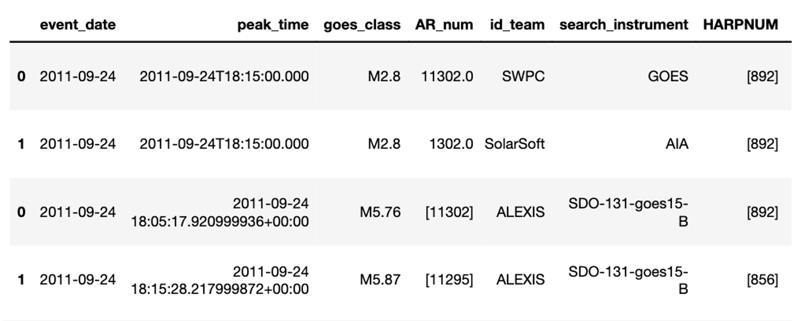

# Automatically Labelled EUV and XRay Incident Solarflare Catalog


ALEXIS is a pipeline that can re-create the integrated X-Ray flux of the full solar disk into the emission from discrete regions in the Extreme UV. This pipeline is intended to help in identifying and cataloging solar flares. 

#
### NOTE: ALEXIS does not run on ARM chips (Linux/X86 only)
#
### NOTE: 0% of this code was written by Large Language Models
#

The main goal of the ALEXIS pipeline is to be able to create an independent data product to localize solar flares. 
A flare list containing the event date, peak-time, Helioprojective Cartesian coordinates, NOAA AR number and HARP identifier is returned.

#
An example of the event list can be seen below:

<center>
  
</center>

#  

### One can either:

1. **Download the event list:**

      If you are only interested in downloading the flare catalog, proceed to the data_products directory. 
      Inside you will find a google link to download the databases and data products. 
      Please register following the link.

2. **Run the pipeline for yourself:**

      If you are interested in running the pipeline for a time-period of your choice from May 5, 2010 to March 1, 2020.

      Please go to the "onboarding" sub-directory, register, and download (or run) each of the sub-scripts located within the "pipeline" sub-directory.

# 

## Requirements:
1. Install conda environment
   ```
   conda env create -f ALEXIS_conda_environment.yml
   ```

2. Activate conda environment
   ```
   conda activate aiadl_2
   ```
   
3. Modify the data config file.
   In the home directory of the repository, change the values of home directory, jsoc email.


License: Noncommercial use permitted under the Polyform Noncommercial License.
Commercial use is reserved exclusively by the author (jpadial15).
Contact for licensing: alexissolarflarecatalog@gmail.com
