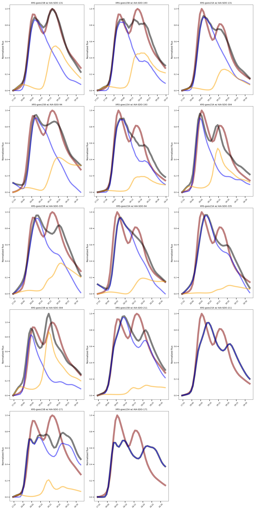

# To access any dataproducts, please register here:

https://drive.google.com/drive/folders/1Poab-OBRVLPP7vvu2RProglKGupSsCZO?usp=sharing

#

This google drive provides access to databases needed to run the pipeline as well as the data products returned from ALEXIS. For more information please feel free to reach out.
For now, we will provide 2 data products and 1 software package. 
These are described below. 

# 1. Event List:

**Please register at the google above to download the event list.**

Download files:

- ALEXIS_1000_hek_report.csv
- ALEXIS_1000_hek_report.parquet
- ALEXIS_1000_hek_report.pickle

  

| Column Name            | Description                                                                                   | Data Type       | Example Value                     |
|------------------------|-----------------------------------------------------------------------------------------------|-----------------|-----------------------------------|
| `event_date`           | The date of the solar flare event.                                                            | `datetime`      | `2025-04-09`                     |
| `peak_time`            | The timestamp of the peak intensity of the solar flare.                                       | `datetime`      | `2025-04-09 12:34:56`            |
| `goes_class`           | The GOES classification of the solar flare, indicating its intensity.                         | `string`        | `C4.0`                           |
| `AR_num`               | The NOAA Active Region (AR) number associated with the solar flare.                           | `integer`       | `12345`                          |
| `hpc_x`                | The helioprojective Cartesian (HPC) x-coordinate of the flare's location on the solar disk.   | `float`         | `-500.0`                         |
| `hpc_y`                | The helioprojective Cartesian (HPC) y-coordinate of the flare's location on the solar disk.   | `float`         | `300.0`                          |
| `hpc_bbox_poly`        | The bounding box polygon in helioprojective Cartesian coordinates enclosing the flare region. | `list`          | `[(x1, y1), (x2, y2), ...]`      |
| `id_team`              | The identifier for the team or algorithm that detected the flare.                             | `string`        | `ALEXIS`                         |
| `search_instrument`    | The instrument used to detect or analyze the flare.                                           | `string`        | `AIA, GOES, `                            |
| `HARPNUM`              | List of HARP number associated to flare. | `list`       | `[3613]`                          |
| `final_cluster_label`  | The label assigned to the flare's cluster during the clustering process.                      | `integer`       | `3`                              |
| `working_dir`          | The directory path where the data and results for this flare are stored.                      | `string`        | `flarecandidate_C4.0_at_2025-04-09T12_34_56.working` |

# 2. Hourly fitted-data for all wavelenghts:
**Please register at the google drive below to download the hourly XRS fit to all imaging wavelengths (EUV and Soft X-ray).**
One can download 

 - ALEXIS_1000_all_fits.csv
 - ALEXIS_1000_all_fits.parquet
 - ALEXIS_1000_all_fits.pickle

 

   
 

# 3. Running the pipeline on a linux machine
**SQlite databases that are created from the *onboarding* directory will reside in the data_products directory**

 If you dont wish to run the onboarding yourself, there are 5 main files you will have to download from the links below. Some of these files are compressed and you must follow the instructions to uncompress. In total, you will need ~120GB of storage space.

#### Thegoogle drive folder will contain all the databases needed to run the pipeline. 

